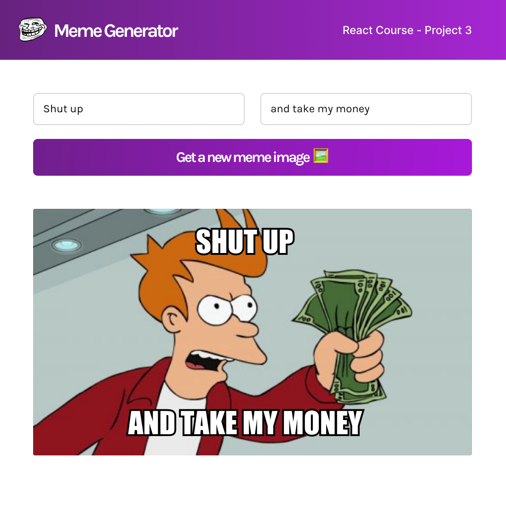

# Meme Generator (Scrimba React Course Project 5)

Requirements: 
- Build a Meme Generator using React designed like this <a href="https://www.figma.com/file/MoLwFPHNHJVrzdFurxHzNV/Meme-Generator">Figma file</a>
- Styled & polished
- React Events
- Forms in React
 
 

